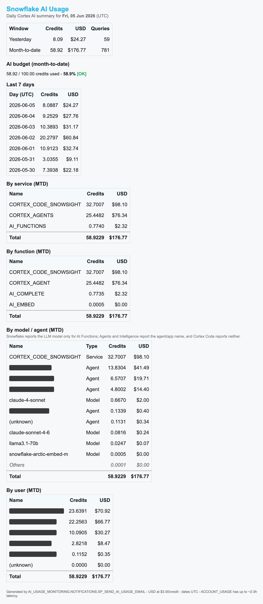

# Snowflake AI Usage — Daily Email Notification Framework

A small, **self-contained** framework that emails you a daily summary of your
Snowflake **Cortex AI** usage — credits, dollars, budget, and breakdowns by
type, subtype (agent/app), function, model, and **user** — using nothing but
standard `SNOWFLAKE.ACCOUNT_USAGE` data and native Snowflake features (a view, a
stored procedure, an email notification integration, and a scheduled task).

**Metering-first:** the headline total and the by-type / by-subtype tables come
from the Snowflake **billing/metering ledger** (`METERING_HISTORY`), so they
**foot to your invoice** and are complete for the latest settled day. The
per-model / function / user drill-downs come from the dedicated Cortex usage
views — richer, but they lag ~39h — so every section is tagged with an **"as of"
date badge** (green *settled* vs amber *detail*) and you always know the data
currency.

No external tools, no warehouses to babysit, no third-party services. Deploy it
once and a report lands in your inbox every morning.

---

## What the email looks like

<p align="center">
  
</p>

<sub>Real run against a live account; user emails and internal agent names redacted.</sub>

```
Snowflake AI Usage - Sat 2026-06-06 - 3.78 credits ($11.35)        <- subject

Snowflake AI Usage   ·   Daily Cortex AI summary (UTC)

How to read this report — two "as of" dates
  [settled · 2026-06-06]  Billed totals, AI by type & subtype (metering ledger)
  [detail  · 2026-06-05 (1 day behind)]  model / function / user drill-downs

▸ BILLED (from the metering ledger)
    Latest settled day & MTD    Credits     USD
    AI budget (MTD)             58.92 / 75.00  [OK]
    AI by type                  Cortex Code, Cortex Agents, AI Services …  → foots to MTD
    AI by type & subtype        per-agent / per-app rows                    → foots to MTD
▸ DETAIL drill-downs (Cortex usage views, ~39h lag)
    By function · By model/agent (Model/Agent/Service type) · By user
▸ TREND
    Last 7 days
```

The **by type** and **by type & subtype** tables **foot to the billed MTD
total**; the drill-down tables foot to the (slightly lagging) detail subset and
are labelled as such.

---

## How it works

```
 SNOWFLAKE.ACCOUNT_USAGE                         AI_USAGE_MONITORING.NOTIFICATIONS
 ┌──────────────────────────────┐                ┌────────────────────────────────┐
 │ METERING_HISTORY  ───────────┼── billed ────▶ │ SP_SEND_AI_USAGE_EMAIL (proc)   │
 │   (AI credits by SERVICE_TYPE │  total/type/   │   • report_day = latest         │
 │    + NAME = agent/app)        │  subtype       │     SETTLED metering day (D-1)  │
 │                               │                │   • IS_AI_SERVICE predicate     │
 │ CORTEX_*_USAGE_HISTORY  ──────┼── detail ────▶ │   • METER_AI_LABEL, guard       │
 │ USERS  (USER_ID → name)       │  model/fn/user │ VW_AI_USAGE (detail view)       │
 └──────────────────────────────┘  via VW_AI_USAGE│ CONFIG · TSK_DAILY_AI_USAGE_EMAIL│
                                                  └───────────────┬────────────────┘
                                  SYSTEM$SEND_EMAIL via           │  08:00 daily
                                  AI_USAGE_EMAIL_INT  ◀───────────┘  (your schedule)
                                                  │
                                                  ▼   📧  your inbox
```

- **Billed total / by type / by type+subtype** come from
  `SNOWFLAKE.ACCOUNT_USAGE.METERING_HISTORY` — the billing ledger. `SERVICE_TYPE`
  is the AI type; `NAME` is the **subtype** (the agent/app the credits billed
  under). This is near real-time and **foots to your invoice**.
- **`IS_AI_SERVICE(service)`** is a prefix predicate (`CORTEX_*`, `AI_*`,
  `SNOWFLAKE_INTELLIGENCE`) — it **auto-includes any new AI service type**
  Snowflake ships, and a banner **flags** any type missing a friendly label.
- **`report_day` is data-driven** — the latest *settled* metering day (D-1) — so
  the email is correct regardless of when the task runs.
- **`VW_AI_USAGE`** unifies the Cortex usage views for the model / function /
  user drill-downs, resolving `USER_NAME`. These views lag ~39h, so those tables
  are tagged with the amber **detail** badge.
- **`SP_SEND_AI_USAGE_EMAIL(BOOLEAN)`** builds the HTML. `TRUE` sends; `FALSE`
  returns the HTML so you can preview without sending.
- **Dollars** are `credits × AI_CREDIT_PRICE_USD` (a single rate you configure).

---

## Prerequisites

- A role that can create the objects and read account usage. **`ACCOUNTADMIN`
  is simplest.** Specifically you need: `CREATE DATABASE`, `CREATE INTEGRATION`,
  `EXECUTE TASK`, and read access to `SNOWFLAKE.ACCOUNT_USAGE` (the
  `ACCOUNTADMIN` chain has the required `IMPORTED PRIVILEGES`).
- The procedure runs `EXECUTE AS OWNER`, so whoever creates it must retain
  `ACCOUNT_USAGE` access — keep it owned by an admin role.
- **A verified recipient email.** Snowflake only sends to addresses that belong
  to a user in your account or have been verified. The email of an existing
  Snowflake user is auto-verified.

---

## Quick start (3 steps)

1. **Edit the parameters** in `01_ai_usage_email_setup.sql` (see the table
   below) — at minimum the recipient and, if you don't want 08:00 IST, the
   schedule.
2. **Run `01_ai_usage_email_setup.sql`** in a Snowsight worksheet (or via the
   Snowflake CLI) as `ACCOUNTADMIN`. It creates everything and resumes the task.
3. **Verify** with `02_verify_and_test.sql` — preview the HTML, then send
   yourself a test.

That's it. The email goes out on your schedule from then on.

---

## Parameters

| Parameter | Where | Default | Notes |
|---|---|---|---|
| **Recipient email** | `01_…setup.sql` (integration + config) — token `you@example.com` | — | Must be verified / an account user's email. Appears **twice**; replace both. |
| **Schedule** | `01_…setup.sql` task `SCHEDULE` | `USING CRON 0 8 * * * Asia/Kolkata` (08:00 IST) | Standard Snowflake CRON + timezone. |
| **Database name** | `01_…setup.sql` — token `AI_USAGE_MONITORING` | `AI_USAGE_MONITORING` | Find-replace if you want a different DB. |
| `AI_CREDIT_PRICE_USD` | `CONFIG` table | `3.00` | Your $/credit. Note: `AI_SERVICES` may bill at your *compute* rate — adjust if your mix is Analyst/Search-heavy. |
| `AI_BUDGET_CREDITS` | `CONFIG` table | `100` | Monthly AI budget. **Set to `0` to hide the budget section.** |
| `BUDGET_WARN_PCT` | `CONFIG` table | `90` | `WARN` badge at ≥ this %; `OVER BUDGET` at ≥ 100%. |
| `TOP_N` | `CONFIG` table | `10` | Rows per drill-down table before an "Others" row. |
| `AI_SUBTYPE_TOP_N` | `CONFIG` table | `12` | Rows in the **by type & subtype** table before an "Others" row. |
| `AI_KNOWN_SERVICE_TYPES` | `CONFIG` table | the 8 current AI types | Comma list of known AI `SERVICE_TYPE`s; anything else matching the predicate is **flagged** in the email so you can add a label. |
| `EMAIL_SUBJECT_PREFIX` | `CONFIG` table | `Snowflake AI Usage` | Subject prefix. |

Everything in the `CONFIG` table can be changed **without redeploying** — just
`UPDATE` the row (see `02_verify_and_test.sql`).

---

## Changing the schedule

The schedule lives on the task (a CRON literal). To change it after deploy:

```sql
ALTER TASK AI_USAGE_MONITORING.NOTIFICATIONS.TSK_DAILY_AI_USAGE_EMAIL SUSPEND;
ALTER TASK AI_USAGE_MONITORING.NOTIFICATIONS.TSK_DAILY_AI_USAGE_EMAIL
  SET SCHEDULE = 'USING CRON 0 9 * * 1-5 America/New_York';   -- 9 AM ET, weekdays
ALTER TASK AI_USAGE_MONITORING.NOTIFICATIONS.TSK_DAILY_AI_USAGE_EMAIL RESUME;
```

CRON is `minute hour day-of-month month day-of-week timezone`. Examples:
`0 8 * * * Asia/Kolkata` (08:00 IST daily) · `30 7 * * 1-5 Europe/London`
(07:30 London, weekdays) · `0 0 1 * * UTC` (midnight UTC on the 1st).

> Because `report_day` is the latest *settled* metering day, the email is correct
> at any run time — the schedule only controls *when* it lands in your inbox.

---

## Adding / changing recipients

A recipient must be in **both** the integration's `ALLOWED_RECIPIENTS` and the
`EMAIL_RECIPIENT` config value:

```sql
ALTER NOTIFICATION INTEGRATION AI_USAGE_EMAIL_INT
  SET ALLOWED_RECIPIENTS = ('ops@example.com', 'lead@example.com');
UPDATE AI_USAGE_MONITORING.NOTIFICATIONS.CONFIG
  SET VALUE = 'ops@example.com' WHERE KEY = 'EMAIL_RECIPIENT';
```

To email a non-user address, verify it first via **Snowsight → your profile →
Notifications**, or use an address that belongs to an account user.

---

## Verify & test

`02_verify_and_test.sql` includes a row-count / total sanity check, the current
config, a **preview** (`CALL …(FALSE)` returns the HTML — save to a `.html` and
open it), a **send a test** (`CALL …(TRUE)`), and task-run inspection.

---

## Customizing

The procedure is plain SQL — easy to extend. Ideas:
- Swap the flat `AI_CREDIT_PRICE_USD` for a **per-service-type** rate (join
  `SNOWFLAKE.ORGANIZATION_USAGE.RATE_SHEET_DAILY`, which prices `AI_SERVICES`
  separately from the AI-compute types).
- Add **per-user sub-tables** (each user's split by service).
- Add a **day-over-day delta** column to the headline.
- Add a **cost-center** dimension if you tag users/roles.

---

## Teardown

`03_teardown.sql` removes everything (suspends + drops the task, drops the
database — which cascades the schema/view/config/proc/functions — and drops the
integration).

---

## Notes & gotchas

- **Two latencies, handled for you:** `METERING_HISTORY` (billed totals) is near
  real-time, so the **billed** sections are complete for D-1. The Cortex
  **detail** views lag ~39h, so the model/function/user tables only settle to
  ~D-2 — the email labels them with the amber *detail* badge and totals them to
  the settled-detail subset, so nothing silently under-reports.
- **Type vs. subtype:** `METERING_HISTORY.SERVICE_TYPE` is the AI **type**
  (e.g. `CORTEX_AGENTS`); `NAME` is the **subtype** — the specific agent/app the
  credits billed under. The function/model dimensions come from the detail views.
- **New AI types are auto-handled:** `IS_AI_SERVICE` is prefix-based
  (`STARTSWITH(SERVICE_TYPE,'AI_')` — *not* `ILIKE 'AI[_]%'`, which matches
  nothing in Snowflake), so a new `CORTEX_*`/`AI_*` type is **counted**
  immediately and **flagged** in the email until you add a friendly label.
- **Model vs. agent:** only **AI Functions** report the underlying LLM model
  (e.g. `claude-4-sonnet`); **Agents** and **Snowflake Intelligence** report the
  *agent/app* name; **Cortex Code** reports neither. The "by model / agent" table
  tags each row with a **Type** (Model / Agent / Service) so they're never
  confused.
- **Least privilege:** for a hardened setup, replace `ACCOUNTADMIN` with a
  purpose-built role granted only `IMPORTED PRIVILEGES` on `SNOWFLAKE`,
  `CREATE INTEGRATION`, `EXECUTE TASK`, and ownership of the framework database.

---

## Files

| File | Purpose |
|---|---|
| `01_ai_usage_email_setup.sql` | One-shot setup: infra + view + config + helpers + proc + integration + task. |
| `02_verify_and_test.sql` | Sanity checks, preview, send a test, inspect task runs. |
| `03_teardown.sql` | Remove everything. |
| `sample_email_redacted.png` | Screenshot of a real run (emails + internal agent names redacted). |
| `sample_email_redacted.html` | The same sample as standalone HTML (open in a browser). |
